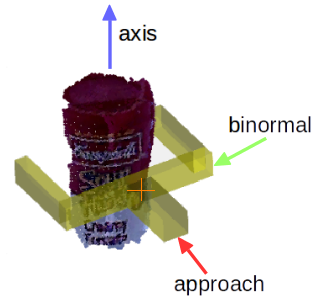

# TP Grasping

The objective of this lab is to allow a robot (here the [Toyota HSR](https://developer.nvidia.com/embedded/community/reference-platforms/toyota-hsr)) to catch objects with its robotic hand.

To do this we will use the robot's cameras to detect the object and then using a library like [GPD](https://github.com/atenpas/gpd) we will calculate the movements of the robotic arm.

- [TP Grasping](#tp-grasping)
  * [Preamble 1: Docker](#preamble-1--docker)
    + [Description](#description)
    + [Why use docker](#why-use-docker)
  * [Simulation](#simulation)
    + [Setting up the environment](#setting-up-the-environment)
  * [Principle of operation](#principle-of-operation)
  * [Image analysis 3h](#image-analysis-3h)
    + [Compile yolo](#compile-yolo)
    + [ROS service](#ros-service)
  * [Object entry 5h](#object-entry-5h)

---

## Preamble 1: Docker

---

### Description

`Docker` is free software for launching applications in containers. This is not about virtualization, but containerization, a lighter form that relies on certain parts of the host machine for its operation.

### Why use docker

To perform the simulation, we will use `ROS` as well as `Gazebo` robot simulation software. However, we will be using specific versions of these software that only work on a specific version of `Ubuntu`. We are therefore going to create docker containers to run the simulation without having to modify the operating system of our computer.

---

## Simulation

---

### Setting up the environment

You must first [install docker](https://docs.docker.com/get-docker/). It is advisable to add your user to the docker group so that you do not have to run docker commands as root:

```bash
sudo usermod -aG docker utilisateur
```

You must now restart your session.

Download the submodules:

```bash
git submodule add https://github.com/hsr-project/hsrb_robocup_dspl_docker.git hsrb_robocup_dspl_docker
git submodule init
git submodule update
```

This will download the simulator, now download the docker image then run your containers:

```bash
cd hsrb_robocup_dspl_docker
sudo apt-get install docker-compose
docker-compose pull

docker-compose up
```

Once your containers are started you should be able to connect with your internet browser to:

- [http: // localhost: 3000 /](http://localhost:3000/) where you will find gazebo

- [http: // localhost: 3001 /](http://localhost:3001/) where you will find visual studio code in order to develop your application, but also to interact with the container using the integrated terminal

---

## Principle of operation

---

Here is an outline of how the grasping system works:

- We analyze the image of the camera with yolo to know the bounding box of the object

- We transmit this bounding box as well as a point cloud to the data entry service

- We "crop" the point cloud to keep only the points inside the bounding box

- We clean the point cloud

- We calculate input configurations to grab the object using GPD (Grasp Pose Detection)

- From this configuration we calculate the successive positions of the robot arm

- We return the input configurations and the arm positions to the client node

- We apply the seizure configuration calculated by the seizure service on the robot arm to catch the object

To perform operations on point clouds we will use PCL (Point Cloud Library) which contains all the tools we will need.

However, GPD and PCL are C ++ libraries, so the input service will be written in C ++.

To start, create your `ROS package`:

```bash
# (Within the container, in the window http://localhost:3001)
cd src
catkin_create_pkg grasping_tp rospy roscpp
```

---

## Image analysis 3h

---

The `ROS node` which will allow image analysis will work thanks to [yolo](https://github.com/AlexeyAB/darknet) a neural network capable of identifying objects on an image. We will use more particularly `tiny yolo` which is a lighter version, but also a little less precise than `yolo`.

### Compile yolo

First of all compile `yolo`:

```bash
cd hsrb_robocup_dspl_docker/src
mkdir dependencies
cd dependencies
git clone https://github.com/AlexeyAB/darknet.git
cd darknet
```

Now modify the file `Makefile` to enable the options we need:

- `LIBSO=1` in order to obtain a `.so` file that allows us to use darknet from another application

- If you are using an nvidia graphics card:

- `GPU=1`

- `CUDNN=1`

- `CUDNN_HALF=1`

You are now ready to start the compilation

```bash
# Dans le conteneur
cd src/dependencies/darknet/
make clean
make
```

### ROS service

This node will in fact be a [ROS service](http://wiki.ros.org/Services), that is, a kind of server to which other nodes can connect to obtain information.

Here the node which will manage the input system will connect to the object detection node to operate.

The first step is therefore to create the [ROS messages](http://wiki.ros.org/msg) which will allow us to communicate in a standardized way between the different nodes.

For example, here is the type of message that our service will return:

```
# This message stores the detected objects

# The list of object names.
std_msgs/String[] object_names

# All the objects bounding boxes coordinates.
grasping_tp/BoundingBoxCoord[] objects_bb

# The source cloud used.
sensor_msgs/PointCloud2 cloud
```

`sensor_msgs/PointCloud2` represents a point cloud, that is, a set of 3-dimensional points representing the material detected around the robot. This will be particularly useful for us to calculate the positions of the robot arm.

---
QUESTIONS :

1. **Create the message** `grasping_tp/BoundingBoxCoord` **which represents the rectangle that surrounds an object in an image**
[Solution](https://github.com/Maelic/grasping_demo/tree/master/grasping_tp_solution/msg/BoundingBoxCoord.msg)

2. **Create the service file** `object_detection` **which takes the time as input and returns the message above**
[Solution](https://github.com/Maelic/grasping_demo/tree/master/grasping_tp_solution/srv/object_detection.srv)

---

The yolo configuration files are given to you.

See [doc](http://wiki.ros.org/ROS/Tutorials/CreatingMsgAndSrv) on message and service creation in ROS. You are now ready to create your node, here is the operating principle:

---
QUESTIONS :

1. **We are waiting to receive a request**

2. **We get the image of the camera and the point cloud from these topics:**

- `/hsrb/head_rgbd_sensor/rgb/image_rect_color`

- `/hsrb/head_rgbd_sensor/depth_registered/rectified_points`

3. **We convert the ROS image into an opencv image and then in yolo image**

4. **We have the image analyzed by `yolo`**

5. **We calculate the positions of the points of the point cloud**

6. **Fill in the message to send**

7. **We return this message**

[Solution](https://github.com/Maelic/grasping_demo/tree/master/grasping_tp_solution/src/detection_node.py)

---

Here are some resources that can help you build your node:

- [How to write an ROS service](http://wiki.ros.org/ROS/Tutorials/WritingServiceClient%28python%29)

- [Get the information of a topic](https://www.programcreek.com/python/example/95407/rospy.wait_for_message)

- [Doc CV bridge](http://wiki.ros.org/cv_bridge)

- [Bridge darknet / python](https://github.com/AlexeyAB/darknet/blob/master/darknet.py)

- [Create the ROS message to resend](http://wiki.ros.org/rospy/Overview/Messages)

- [Obtain the points of a point cloud](https://answers.ros.org/question/240491/point_cloud2read_points-and-then/)

---

## Object entry 5h

---

The object capture module is also composed of a service written in C ++ which calculates the coordinates of the successive positions of the robot arm in order to be able to grab an object. To do this, the ROS messages must first be created to allow communication between the entry node (which orchestrates the entry) and the entry service (which calculates the entry configurations).

Here is the message containing an input configuration:

```
# This message describes a 2-finger grasp configuration by its 6-DOF pose,
# consisting of a 3-DOF position and 3-DOF orientation, and the opening
# width of the robot hand.

# Position
geometry_msgs/Point position # grasp position (bottom/base center of robot hand)

geometry_msgs/Pose actual_pose # grasp position (bottom/base center of robot hand)
geometry_msgs/Pose pre_pose # grasp position (bottom/base center of robot hand)
geometry_msgs/Pose after_pose # grasp position (bottom/base center of robot hand)

# Orientation represented as three axis (R = [approach binormal axis])
geometry_msgs/Vector3 approach # grasp approach direction
geometry_msgs/Vector3 binormal # hand closing direction
geometry_msgs/Vector3 axis # hand axis

std_msgs/Float32 width # Required aperture (opening width) of the robot hand

std_msgs/Float32 score # Score assigned to the grasp by the classifier

geometry_msgs/Point sample # point at which the grasp was found
```

---
QUESTIONS :

1. **Create the message returned by the service which contains all the calculated configurations**
[Solution](https://github.com/Maelic/grasping_demo/tree/master/grasping_tp_solution/msg/GraspConfigList.msg)

2. **Create the message to perform an input request (for function the input service needs a point cloud and a bounding box)**
[Solution](https://github.com/Maelic/grasping_demo/tree/master/grasping_tp_solution/msg/GraspServerRequest.msg)

3. **Create the service file** `detect_grasps` **which takes an input request and returns the calculated configurations**
[Solution](https://github.com/Maelic/grasping_demo/tree/master/grasping_tp_solution/srv/detect_grasps.srv)

---

See the [doc](http://wiki.ros.org/ROS/Tutorials/CreatingMsgAndSrv) on message and service creation in ROS.

You are now ready to create your data entry node, which is how it works (carry out instructions 1 to 3 for now, you will do the others when the data entry service is written):

---
QUESTIONS :

1. **We make a request to the image analysis service**

2. **We make a request to the data entry service to obtain the data entry configurations, we choose the first configuration which is the best**

3. **We apply this configuration**

[Solution](https://github.com/Maelic/grasping_demo/tree/master/grasping_tp_solution/src/grasping_node.py)

---

Here are resources for Instructions 1 to 3:

- [Use an ROS service](http://wiki.ros.org/ROS/Tutorials/WritingServiceClient%28python%29)

We must now write the data entry service for that we must first install the dependencies.

Install PCL:

```bash
# Dans le conteneur
sudo apt update 
sudo apt install ros-melodic-pcl-ros
```

Install GPD:

```bash
cd hsrb_robocup_dspl_docker/src/dependencies/
git clone https://github.com/atenpas/gpd.git
cd gpd
awk '/find_package\(PCL/{$2=1.8}1;' CMakeLists.txt > CMakeLists.txt
mkdir build && cd build
cmake ..
make -j
sudo make install
```

Use the given CMakeLists.txt file to be able to use PCL and GPD, beware your names for messages and services are probably different from mine.

Here is the operating principle of the data entry service:

---
QUESTIONS :

1. **We are waiting to receive a request (bounding box + point cloud)**

2. **We "crop" the point cloud according to the bounding box**

3. **We remove the undefined points in the point cloud**

4. **We use GPD with the point cloud**

5. **We calculate the positions of the robot arm according to the configurations returned by GPD**

6. **We return the arm positions and the configurations**

[Solution](https://github.com/Maelic/grasping_demo/tree/master/grasping_tp_solution/src/grasping_service.cpp)

---


Processing of the received point cloud (here a [segmentation of flat objects] (https://pointclouds.org/documentation/tutorials/extract_indices.html) has also been added) 

To operate GPD needs a given configuration file.

Use the following point cloud type which is compatible with GPD: `pcl::PointCloud<pcl::PointXYZRGBA>::Ptr`

Here are some resources that can help you write the service:

- [Write a ROS service in C ++](http://wiki.ros.org/roscpp_tutorials/Tutorials/WritingServiceClient)

- [Import a point cloud into PCL](http://docs.ros.org/en/indigo/api/pcl_conversions/html/namespacepcl.html#af662c7d46db4cf6f7cfdc2aaf4439760)

- [Extract certain point from a point cloud](https://pointclouds.org/documentation/tutorials/extract_indices.html), useful for "cropping" (do not use segmentation, the points to extract are those inside the bounding box)

- [Example of using GPD](https://github.com/atenpas/gpd/blob/master/src/detect_grasps.cpp)

- [hand.h](https://github.com/atenpas/gpd/blob/master/include/gpd/candidate/hand.h) format returned by GPD:


- [Eigen to ROS message](https://docs.ros.org/en/api/eigen_conversions/html/eigen__msg_8h.html)

- [Doc GPD](https://github.com/atenpas/gpd)

- [GPD ROS](https://github.com/atenpas/gpd_ros/) for inspiration

Now that the input service is written **you can end the input node**, here are some useful resources:

- The `utils.py` file contains material for making movements with the robot, practical for moving the robot's arm, shaking the robot's hand, moving the robot's head ...

- [Doc moveit](http://docs.ros.org/en/melodic/api/moveit_tutorials/html/doc/move_group_python_interface/move_group_python_interface_tutorial.html) to move the robot's joints


